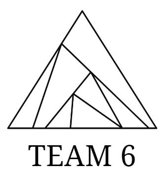

# WASSUP_FinalProject_team6

## EST soft WASSUP AI 개발과정 2기 파이널 프로젝트
**(Team 6)**
**팀원 및 담당 업무**
  + 김형범
  + 김현주
  + 최정민
  + **모든 인원이 모든 과정에 참여합니다. 담당 업무는 명목상 정했습니다. 모든 인원이 프로젝트를 이끌어 나가는 중 입니다**
---
## Our Subject
**실시간 감정분석 기반 LLM 챗봇**

주제 선정 동기, 주제 세부 사항 등 추후 추가

## Files
  + **image_crop.ipynb** : 이미지 crop 작업을 수행
  + **data_preprocess.py** : 모델 학습을 위해 데이터 전처리, 증강을 수행합니다.
  + **model.py** : 모델이 정의된 파일입니다.
  + **train.py** : train set을 사용해 모델을 학습하고 validation set으로 성능을 검증합니다.
  + **test.py** : 학습된 모델의 test set에 대한 성능을 측정합니다.
  + **demo.py** : 실시간 감정분석 챗봇을 실행합니다.

## How to use
  + 모델 학습
  + 
